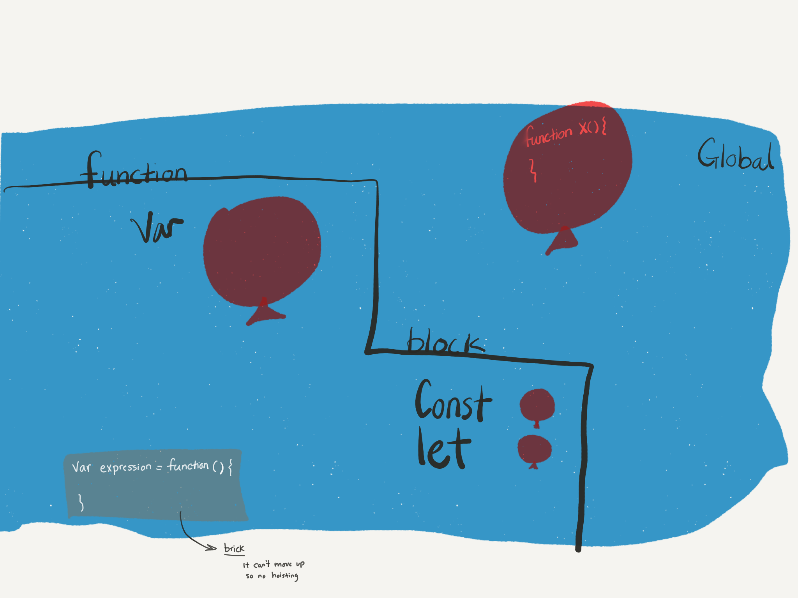

# Hoisting

What the hell is that? literal translation is "an act of raising or lifting something". In javascript,

> it refers to variable _declaration_ moving up to top of their _scope_.

The key words here are: **declaration** and **scope**
Without getting too technical, declaration is when you create a variable but don't assign any value to it.

`const`, `let`, `var` are keywords used to declare a variable in javascript. They behave differently when it comes to hoisting.

Since `functions` are first-class citizens, they may or may not be hoisted.

If each red circle in the picture below is a balloon in a pool, we can see how they behave when it comes to hoisting.

There is more to this so more to come. ✌🏼
